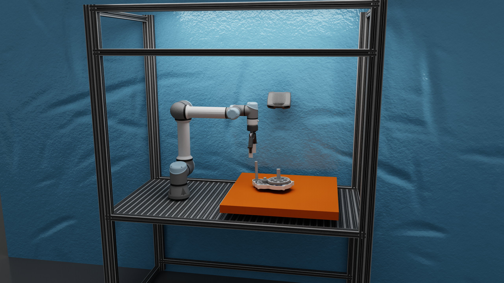
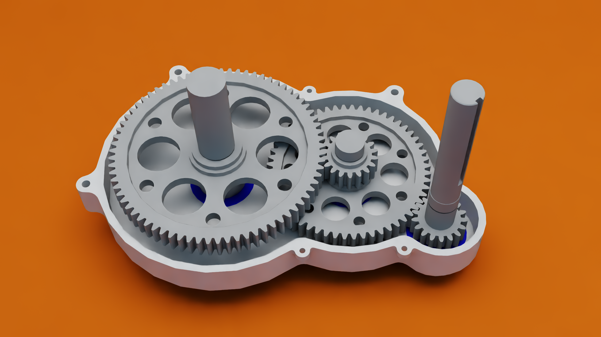

# Robot Workcell USD

Portable Isaac Sim USD assets for a gearbox-disassembly workcell with a UR5e + Robotiq 2F-140, Zivid camera, fixed workcell, and gearbox.

## Workcell overview



## Gearbox workpiece




## Repository layout

```text
├── assets
│   ├── grippers
│   ├── robots
│   │   └── ur5e_with_robotiq_2f_140
│   ├── sensors
│   │   └── zivid
│   ├── textures
│   │   └── fabric_0032_normal_opengl_1k.png
│   ├── workcells
│   │   └── racpro-isaac
│   └── workpiece
│       └── GearBox
├── docs
│   └── images
│       ├── gearbox.jpg
│       └── workcell.jpg
├── LICENSE.txt
├── README.md
├── scenes
│   └── gearbox_disassembly.usda
├── scripts
│   └── add_pickit_and_ros2_omnigraph.py
└── THIRD_PARTY_NOTICES.md


```
## Requirements

- NVIDIA Isaac Sim **6.1**.
- ROS 2 Jazzy (Only for ROS2 topic based controller or point cloud publisher)

Set your Isaac Sim location once per terminal:

```bash
export ISAACSIM_ROOT="$HOME/isaacsim"
```

Source the Isaac Sim supported ROS 2 distribution:

```bash
source /opt/ros/<your_ros_distro>/setup.bash
```

## Clone the repository

```bash
git clone https://github.com/ifu-ev/robot_workcell_usd.git robot_workcell_usd
cd robot_workcell_usd
git checkout isaacsim_6.1

```

## Open the base scene

Start Isaac Sim 6.1 and open:

```text
<repository-root>/scenes/gearbox_disassembly.usda
```

Open `scenes/gearbox_disassembly.usda` in Isaac Sim 6.1. Before adding ROS graphs, press Play and confirm that the robot, gripper, workcell, and gearbox are stable.

## Adding ROS2 Omnigraphs
### Option A: Standalone ROS builder

The standalone builder opens the scene, validates the required prims, creates selected graphs, saves the root layer, and exits.

```bash
export ISAACSIM_ROOT="$HOME/isaacsim"
"$ISAACSIM_ROOT/python.sh" \
  scripts/add_pickit_and_ros2_omnigraph.py \
  --root "$PWD" \
  --headless
```

```bash
# Controller, joint state, and clock only.
"$ISAACSIM_ROOT/python.sh" scripts/add_pickit_and_ros2_omnigraph.py \
  --root "$PWD" --no-pickit --headless

# Zivid publishers and TF only.
"$ISAACSIM_ROOT/python.sh" scripts/add_pickit_and_ros2_omnigraph.py \
  --root "$PWD" --no-moveit --headless

# Replace only requested existing graph paths.
"$ISAACSIM_ROOT/python.sh" scripts/add_pickit_and_ros2_omnigraph.py \
  --root "$PWD" --overwrite --headless
```

The full builder creates:

```text
/World/ROS2/Topic_Based_Controller
/World/ROS2/Camera_Publisher
/World/ROS2/TF_Publisher
```

### Option B: Script Editor GUI builder

Use this option when the scene is already open in Isaac Sim. The complete GUI code is committed as:

```python
# Paste this complete file into Isaac Sim 6.1 Window > Script Editor and press Run.
from pxr import Sdf, Usd
import omni.graph.core as og
import omni.kit.app
import omni.ui as ui
import omni.usd
import traceback

# Set the following to your specific scene
ROBOT="/World/ur5e_"
JOINT=f"{ROBOT}/root_joint" 
CAMERA="/World/Zivid/projector" 
PARENT=f"{ROBOT}/world"
ROOT="/World/ROS2" 
CTRL=f"{ROOT}/Topic_Based_Controller" 
CAM=f"{ROOT}/Camera_Publisher" 
TF=f"{ROOT}/TF_Publisher"

def edit(path,nodes,links,values=()):
    k=og.Controller.Keys; d={k.CREATE_NODES:nodes,k.CONNECT:links}
    if values: d[k.SET_VALUES]=list(values)
    og.Controller.edit({"graph_path":path,"evaluator_name":"execution"},d)

def rel(stage,path,name,targets):
    r=stage.GetPrimAtPath(path).GetRelationship(name)
    if not r: raise RuntimeError(f"Missing relationship: {path}.{name}")
    r.SetTargets([Sdf.Path(x) for x in targets])

def controller(s):
    edit(CTRL,[("tick","omni.graph.action.OnPlaybackTick"),("read","isaacsim.sensors.physics.IsaacReadJointState"),("pub","isaacsim.ros2.bridge.ROS2PublishJointState"),("sub","isaacsim.ros2.bridge.ROS2SubscribeJointState"),("ctrl","isaacsim.core.nodes.IsaacArticulationController"),("ctx","isaacsim.ros2.bridge.ROS2Context"),("qos","isaacsim.ros2.bridge.ROS2QoSProfile"),("time","isaacsim.core.nodes.IsaacReadSimulationTime"),("clock","isaacsim.ros2.bridge.ROS2PublishClock")],[("tick.outputs:tick","read.inputs:execIn"),("read.outputs:execOut","pub.inputs:execIn"),("tick.outputs:tick","sub.inputs:execIn"),("tick.outputs:tick","ctrl.inputs:execIn"),("tick.outputs:tick","clock.inputs:execIn"),("read.outputs:jointNames","pub.inputs:jointNames"),("read.outputs:jointPositions","pub.inputs:jointPositions"),("read.outputs:jointVelocities","pub.inputs:jointVelocities"),("read.outputs:jointEfforts","pub.inputs:jointEfforts"),("read.outputs:jointDofTypes","pub.inputs:jointDofTypes"),("read.outputs:stageMetersPerUnit","pub.inputs:stageMetersPerUnit"),("read.outputs:sensorTime","pub.inputs:sensorTime"),("ctx.outputs:context","pub.inputs:context"),("ctx.outputs:context","sub.inputs:context"),("ctx.outputs:context","clock.inputs:context"),("qos.outputs:qosProfile","pub.inputs:qosProfile"),("qos.outputs:qosProfile","sub.inputs:qosProfile"),("qos.outputs:qosProfile","clock.inputs:qosProfile"),("time.outputs:simulationTime","clock.inputs:timeStamp"),("sub.outputs:jointNames","ctrl.inputs:jointNames"),("sub.outputs:positionCommand","ctrl.inputs:positionCommand"),("sub.outputs:velocityCommand","ctrl.inputs:velocityCommand"),("sub.outputs:effortCommand","ctrl.inputs:effortCommand")],[("time.inputs:resetOnStop",True),("ctrl.inputs:robotPath",JOINT)])
    rel(s,f"{CTRL}/read","inputs:prim",[JOINT]); rel(s,f"{CTRL}/ctrl","inputs:targetPrim",[ROBOT])

def camera_and_tf(s,w,h):
    edit(CAM,[("tick","omni.graph.action.OnPlaybackTick"),("rp","isaacsim.core.nodes.IsaacCreateRenderProduct"),("ctx","isaacsim.ros2.bridge.ROS2Context"),("qos","isaacsim.ros2.bridge.ROS2QoSProfile"),("pcl","isaacsim.ros2.bridge.ROS2CameraHelper"),("rgb","isaacsim.ros2.bridge.ROS2CameraHelper"),("info","isaacsim.ros2.bridge.ROS2CameraInfoHelper")],[("tick.outputs:tick","rp.inputs:execIn"),("rp.outputs:execOut","pcl.inputs:execIn"),("rp.outputs:execOut","rgb.inputs:execIn"),("rp.outputs:execOut","info.inputs:execIn"),("ctx.outputs:context","pcl.inputs:context"),("ctx.outputs:context","rgb.inputs:context"),("qos.outputs:qosProfile","pcl.inputs:qosProfile"),("qos.outputs:qosProfile","rgb.inputs:qosProfile"),("qos.outputs:qosProfile","info.inputs:qosProfile"),("rp.outputs:renderProductPath","pcl.inputs:renderProductPath"),("rp.outputs:renderProductPath","rgb.inputs:renderProductPath"),("rp.outputs:renderProductPath","info.inputs:renderProductPath")],[("rp.inputs:width",w),("rp.inputs:height",h),("qos.inputs:depth",5),("qos.inputs:durability","transientLocal"),("qos.inputs:reliability","bestEffort"),("pcl.inputs:frameId","ZividCamera"),("pcl.inputs:topicName","ZividCamera/pointcloud"),("pcl.inputs:type","depth_pcl"),("rgb.inputs:frameId","ZividCamera"),("rgb.inputs:topicName","ZividCamera/rgb"),("rgb.inputs:type","rgb"),("info.inputs:frameId","ZividCamera"),("info.inputs:topicName","ZividCamera/camera_info")])
    rel(s,f"{CAM}/rp","inputs:cameraPrim",[CAMERA])
    edit(TF,[("tick","omni.graph.action.OnPlaybackTick"),("tree","isaacsim.core.nodes.IsaacComputeTransformTree"),("pub","isaacsim.ros2.bridge.ROS2PublishTransformTree"),("time","isaacsim.core.nodes.IsaacReadSimulationTime"),("ctx","isaacsim.ros2.bridge.ROS2Context"),("qos","isaacsim.ros2.bridge.ROS2QoSProfile")],[("tick.outputs:tick","tree.inputs:execIn"),("tree.outputs:execOut","pub.inputs:execIn"),("tree.outputs:parentFrames","pub.inputs:parentFrames"),("tree.outputs:childFrames","pub.inputs:childFrames"),("tree.outputs:translations","pub.inputs:translations"),("tree.outputs:orientations","pub.inputs:orientations"),("time.outputs:simulationTime","pub.inputs:timeStamp"),("ctx.outputs:context","pub.inputs:context"),("qos.outputs:qosProfile","pub.inputs:qosProfile")])
    rel(s,f"{TF}/tree","inputs:parentPrim",[PARENT]); rel(s,f"{TF}/tree","inputs:targetPrims",[CAMERA])

class Builder:
    def __init__(self):
        self.pickit=ui.SimpleBoolModel(True); self.moveit=ui.SimpleBoolModel(True)
        self.overwrite=ui.SimpleBoolModel(False); self.save=ui.SimpleBoolModel(True)
        self.width=ui.SimpleIntModel(972); self.height=ui.SimpleIntModel(600)
        self.window=ui.Window("ROS2 OmniGraph Builder",width=570,height=410)
        with self.window.frame:
            with ui.VStack(spacing=8):
                ui.Label("Isaac Sim 6.1 ROS2 OmniGraph Builder",style={"font_size":20})
                ui.Label("Open and save gearbox_disassembly.usda before creation.",word_wrap=True)
                with ui.HStack(height=24): ui.CheckBox(model=self.pickit,width=24); ui.Label("Pickit: Zivid RGB, point cloud, camera info, and TF")
                with ui.HStack(height=24): ui.CheckBox(model=self.moveit,width=24); ui.Label("MoveIt2: controller, joint state, and clock")
                ui.Label("Zivid render-product resolution")
                with ui.HStack(height=28):
                    ui.Label("Width",width=65); ui.IntField(model=self.width,width=150)
                    ui.Label("Height",width=65); ui.IntField(model=self.height,width=150)
                with ui.HStack(height=24): ui.CheckBox(model=self.overwrite,width=24); ui.Label("I confirm replacement of selected existing graphs")
                with ui.HStack(height=24): ui.CheckBox(model=self.save,width=24); ui.Label("Save scene after graph creation")
                ui.Button("Create Graphs",height=36,clicked_fn=self.create)
                self.status=ui.Label("Select graph types, then click Create Graphs.",word_wrap=True,height=64)

    def message(self,text):
        self.status.text=text; print("ROS2 OmniGraph Builder:",text)

    def create(self):
        try:
            pickit=self.pickit.get_value_as_bool(); moveit=self.moveit.get_value_as_bool()
            w=self.width.get_value_as_int(); h=self.height.get_value_as_int()
            if not pickit and not moveit: raise RuntimeError("Select Pickit and/or MoveIt2.")
            if w<=0 or h<=0: raise RuntimeError("Camera width and height must be positive.")
            s=omni.usd.get_context().get_stage()
            if s is None or s.GetRootLayer().anonymous: raise RuntimeError("Open and save a USD stage before creating graphs.")
            needed=([] if not moveit else [ROBOT,JOINT])+([] if not pickit else [CAMERA,PARENT])
            missing=[x for x in needed if not s.GetPrimAtPath(x).IsValid()]
            if missing: raise RuntimeError("Missing required prim(s): "+", ".join(missing))
            wanted=([] if not moveit else [CTRL])+([] if not pickit else [CAM,TF])
            existing=[x for x in wanted if s.GetPrimAtPath(x).IsValid()]
            if existing and not self.overwrite.get_value_as_bool():
                raise RuntimeError("Existing graph(s): "+", ".join(existing)+". Check the overwrite confirmation box and click Create Graphs again to replace only these graphs.")
            manager=omni.kit.app.get_app().get_extension_manager()
            for ext in ("isaacsim.ros2.bridge","isaacsim.sensors.physics.nodes"):
                if not manager.is_extension_enabled(ext): manager.set_extension_enabled_immediate(ext,True)
            with Usd.EditContext(s,Usd.EditTarget(s.GetRootLayer())):
                if not s.GetPrimAtPath(ROOT).IsValid(): s.DefinePrim(ROOT,"Scope")
                for x in existing: s.RemovePrim(x)
                if moveit: controller(s)
                if pickit: camera_and_tf(s,w,h)
                if self.save.get_value_as_bool(): s.GetRootLayer().Save()
            saved=" Scene saved." if self.save.get_value_as_bool() else " Save manually with Ctrl+S."
            self.message("Created: "+", ".join(wanted)+"."+saved)
        except Exception as e:
            traceback.print_exc(); self.message("Creation failed: "+str(e))

try: 
  ROS2_OMNIGRAPH_BUILDER.window.visible=False
except Exception as ex: 
  print(f"\nWarning: {ex}\n")
ROS2_OMNIGRAPH_BUILDER=Builder()

```

1. Open and save `scenes/gearbox_disassembly.usda`.
2. Open **Window → Script Editor**.
3. Copy the **entire** contents into a new Python tab, and press **Run**.
4. The **ROS2 OmniGraph Builder** window appears.
5. Select one or both graph groups:
    * **a. Pickit:** Enable to create ROS2 point cloud publisher
    * **b. Moveit:** Enable to create `/joint_states` publisher and `/joint_command` subscriber
6. Set the desired **camera resolution** for Pickit
7. Press **Create Graphs**.

The GUI exposes these controls:

| Control | Result |
|---|---|
| Pickit | Creates Zivid RGB, point-cloud, camera-info, and TF graphs |
| MoveIt2 | Creates controller, joint-state, and clock graph |
| Width / Height | Zivid render-product resolution; default 972 × 600 |
| I confirm replacement of selected existing graphs | Permits replacement of only selected graph paths |
| Save scene after graph creation | Saves `gearbox_disassembly.usda` after successful creation |


## OmniGraph details

Required stage contract:

```text
Robot wrapper:           /World/ur5e_
Articulation root joint: /World/ur5e_/root_joint
Zivid camera:            /World/Zivid/projector
TF parent:               /World/ur5e_/world
```

The 6.1 builders use the corrected node definitions and wiring:

```text
Enabled extension: isaacsim.sensors.physics.nodes
Joint-state reader: isaacsim.sensors.physics.IsaacReadJointState
Joint timestamp: IsaacReadJointState.outputs:sensorTime
                 → ROS2PublishJointState.inputs:sensorTime
TF data: IsaacComputeTransformTree
      → ROS2PublishTransformTree
```

Zivid output defaults:

```text
Frame ID:     ZividCamera
RGB topic:    ZividCamera/rgb
Point cloud:  ZividCamera/pointcloud
Camera info:  ZividCamera/camera_info
```

## Validation

After graph creation:

1. Confirm selected graph prims under `/World/ROS2`.
2. Press Play and verify the UR5e remains stable.
3. Confirm the Zivid render product initializes.
4. Source the workstation ROS 2 distribution and run `ros2 topic list`.
5. Verify gearbox, plank, and Zelle visibility in RGB and point-cloud output.

Before commit:

```bash
git status
git diff --check
git diff --stat
```

Do not author physics, materials, colliders, or transforms below composed robot collision instance-proxy paths such as `/World/ur5e_/wrist_3_link/collisions/...`. Keep project-specific USD dependencies repository-relative. 

## License

The **MIT License** applies only to original copyrightable material authored for this repository, except where a file, directory, or accompanying notice states otherwise. Third-party assets remain subject to their applicable rights, terms, notices, and redistribution conditions; see `THIRD_PARTY_NOTICES.md`.

#### GearBox workpiece

assets/workpiece/GearBox/ contains modified and OpenUSD-converted assets derived from a CAD model obtained from the GrabCAD Library. The GearBox files are supplied **only to allow visualization of this repository's educational demonstration**. They are not licensed under the repository's MIT License.

The repository maintainers grant no licence, sublicence, reuse permission, modification permission, redistribution permission, or commercial-use permission for the GearBox CAD/USD assets. For any use other than visualization, the users must obtain and verify any necessary rights directly from the applicable upstream rights holder(s) and under the applicable upstream terms. See `assets/workpiece/GearBox/NOTICE.md`.
